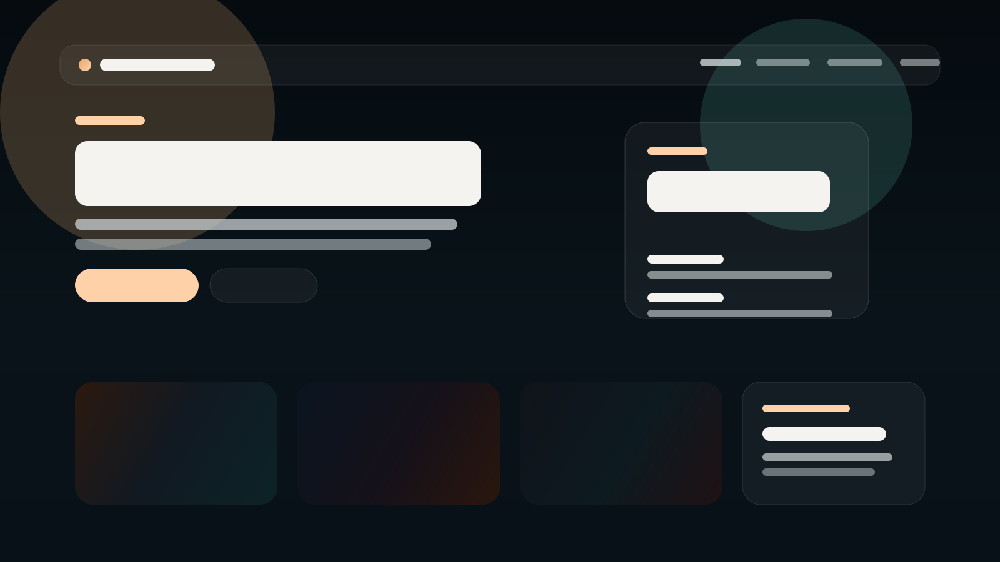

# Nova Rota Studio

Landing page conceitual para uma agência de branding e desenvolvimento digital, criada como peça de portfólio com foco em apresentação premium, responsividade, clareza comercial e deploy estático simples.



## Sobre o projeto

O objetivo deste site é demonstrar a construção de uma interface institucional sofisticada usando apenas HTML, CSS e JavaScript puros, sem depender de framework ou bundler. A proposta prioriza:

- hierarquia visual forte;
- leitura clara em desktop, tablet e mobile;
- microinterações sutis;
- front-end estático fácil de publicar na Vercel;
- conteúdo neutro, sem nomes de pessoas.

Todo o conteúdo é conceitual e foi ajustado para apresentação pública em portfólio.

## Funcionalidades

- Hero com atmosfera visual premium, CTAs e resumo da proposta.
- Navegação sticky com destaque da seção ativa.
- Menu responsivo com comportamento acessível em telas menores.
- Seções de cases, métricas, serviços, método, depoimentos e contato.
- Contadores animados com respeito a `prefers-reduced-motion`.
- Carrossel de depoimentos com suporte a teclado.
- Formulário demonstrativo com validação em tempo real, máscara de telefone e campos condicionais.
- Estrutura estática pronta para deploy em Vercel.

## Tecnologias utilizadas

- HTML5 semântico
- CSS3 com variáveis, Grid, Flexbox e media queries
- JavaScript ES Modules
- Google Fonts: Manrope e Syne
- Vercel para hospedagem estática

## Estrutura de pastas

```text
.
|-- index.html
|-- README.md
|-- tests
|   `-- main.test.mjs
|-- vercel.json
`-- src
    |-- assets
    |   `-- readme
    |       `-- site-preview.svg
    |-- scripts
    |   `-- main.mjs
    `-- styles
        `-- main.css
```

## Como clonar o repositório

```bash
git clone URL_DO_REPOSITORIO
cd site-1-agencia
```

## Como rodar localmente

Você pode abrir o arquivo `index.html` diretamente no navegador, mas o ideal é usar um servidor estático local.

Exemplo com Python:

```bash
python -m http.server 4173
```

Depois acesse:

```text
http://127.0.0.1:4173
```

## Como validar o projeto

Verificação de sintaxe do JavaScript:

```bash
node --check src/scripts/main.mjs
```

Verificação das funções utilitárias:

```bash
node tests/main.test.mjs
```

## Build de produção

Este projeto não possui etapa de build. Como é um site estático, a publicação em produção pode ser feita diretamente a partir dos arquivos versionados.

## Deploy na Vercel

Como o projeto é estático, o deploy na Vercel é direto:

1. Importe o repositório na Vercel.
2. Mantenha a raiz do projeto como diretório de publicação.
3. Não é necessário comando de build.
4. Publique o projeto.

O arquivo `vercel.json` foi incluído para manter o deploy consistente e aplicar cabeçalhos básicos.

## Organização e decisões do front-end

- O layout original foi preservado como landing page de seção única.
- O acabamento visual foi refinado sem descaracterizar a identidade já existente.
- Os depoimentos e campos de contato usam nomes genéricos, sem pessoas identificáveis.
- O JavaScript foi migrado para módulo ES para melhorar organização e testabilidade.

## Melhorias futuras

- Adicionar imagens reais ou capturas finais do site no README.
- Integrar o formulário com um serviço real de envio ou CRM.
- Incluir auditoria automatizada de acessibilidade e performance.
- Adicionar favicon e Open Graph image personalizados.

## Autor / créditos

Projeto preparado para apresentação pública de portfólio. Caso queira expor autoria, prefira identificar apenas a marca, estúdio ou empresa, sem inserir nomes pessoais no conteúdo da interface.

## Licença

Defina a licença conforme a estratégia do repositório público. Se quiser uma base simples, `MIT` costuma ser suficiente para projetos de portfólio.
